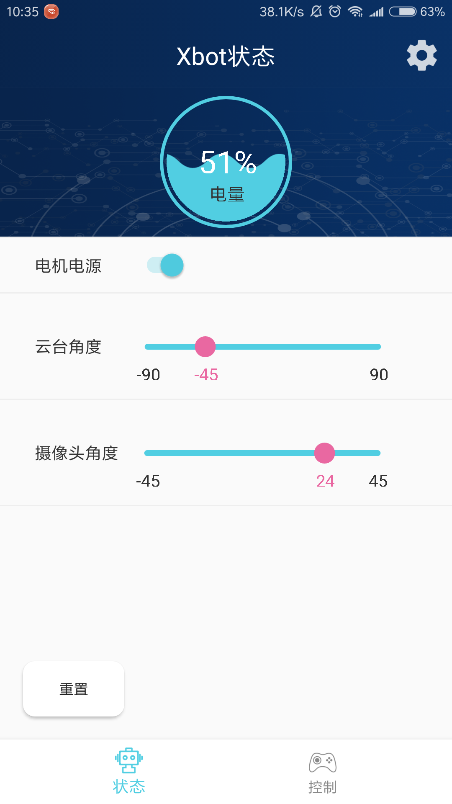
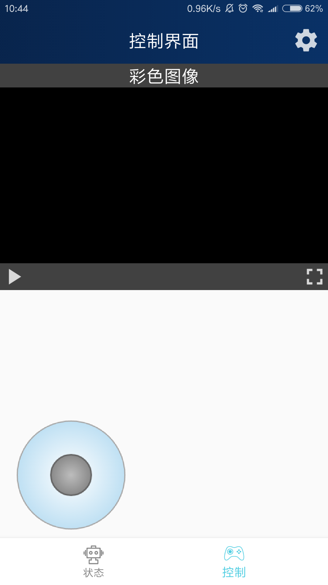
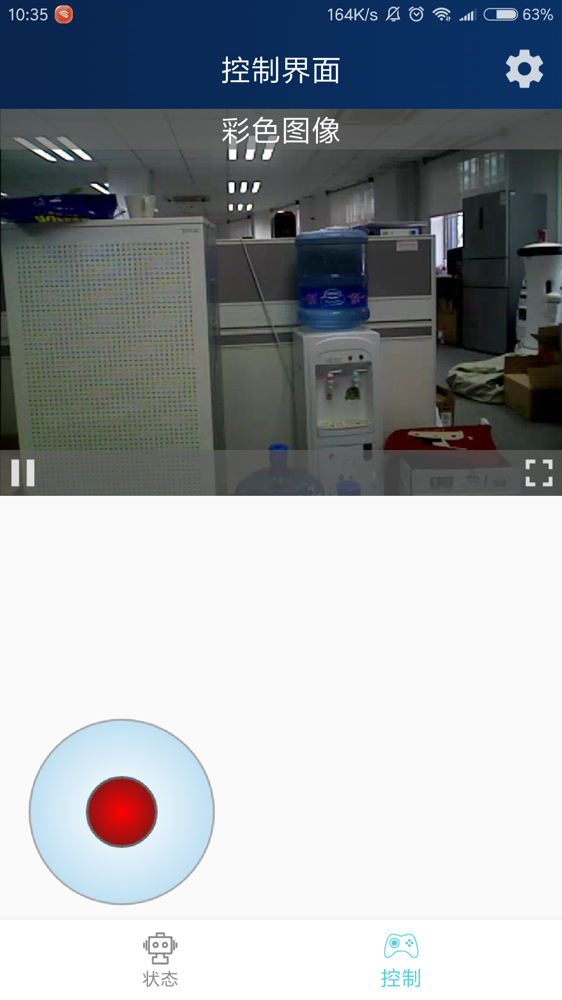
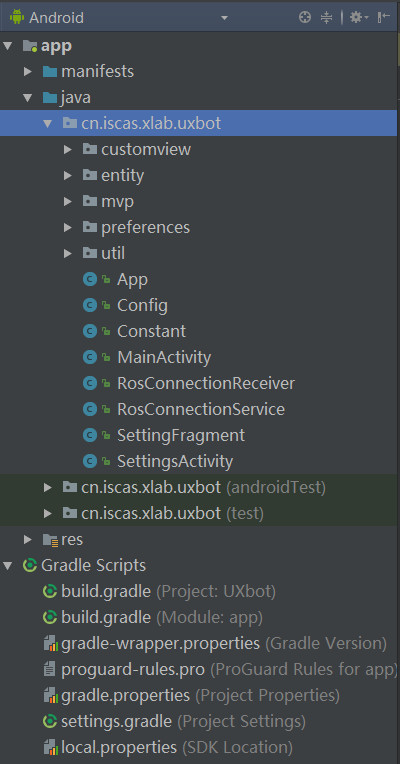

# Xbot 助手开发说明文档 

写作者  ：  [lisongting](https://github.com/lisongting)

修改日期： 2018 年 1 月 18 日

---

### 目录：

+ [项目介绍](#项目介绍)
+ [项目结构](#项目结构)
+ [代码结构](#代码结构)
+ [关键代码说明](#关键代码说明)

## 项目介绍

Xbot助手是面向用户的操作终端，方便用户实时掌控Xbot状态以及对Xbot进行交互操作。用户可以从Xbot助手上了解当前Xbot机器人的电量，摄像头俯仰角度，摄像头平台的旋转角度。用户也可以通过Xbot助手来调节Xbot的摄像头俯仰角度、摄像头平台旋转角度。用户可以通过界面上的摇杆控件，来控制Xbot机器人进行移动，还可以实时查看Xbot上的摄像头拍摄到的图像。

Xbot助手的源代码位于：https://github.com/lisongting/uxbot 

Xbot助手下载链接：http://fir.im/w5dq

开发者进行此项目开发需要预先了解一些知识点：

* [ROS](http://wiki.ros.org/ROS/) 
* [ROS Bridge](http://wiki.ros.org/rosbridge_suite)
* ROS教程推荐：
  * [RosWiki](http://wiki.ros.org/cn/)
  * [创客智造](http://www.ncnynl.com/)
  * [ROS-Academy-for-Beginners](https://github.com/sychaichangkun/ROS-Academy-for-Beginners) 

（建议先阅读Xbot Head说明文档再阅读Xbot助手说明文档，两个项目有一些类似之处）

## 项目结构

该项目的主要由以下功能模块构成：

### 1.状态模块

状态功能模块可以在界面上查看Xbot机器人的电量，摄像头角度和云台角度(摄像头平台旋转角度)。




### 2.控制模块 

控制模块由两部分组成：

* 显示摄像头采集的图像
* 使用摇杆控制Xbot移动

初始界面：



当连接成功Ros服务器，并且ROS服务端启动了摄像头推流程序后，Xbot助手上就可以观看到摄像头采集的视频流。



## 代码结构

该项目的代码结构如下：


对文件夹的说明:

customview 文件夹下是一些自定义View，entity文件夹下主要是一些数据实体类，mvp文件夹中的是项目的两个主功能模块代码，包括界面和逻辑实现，采用mvp架构，preferences中是一些自定义Preference，Util中是工具类。

使用到的Jar包如下：


其中，ros.jar包是一个可用于Android应用与ROS进行跨平台交互的Java包。这里是我将一个开源框架ROSBridge打包的，其源码位于：https://github.com/djilk/ROSBridgeClient  ，作者并没有提供Jar包，我自己对一些代码进行增删后打的包。

导入该包，可以在Java层通过RosBridge协议和ROS底层(Xbot机器人)进行交互，该开源项目把Java与ROS的通信过程进行了封装，方便开发者用Java代码与Ros底层通信。在后续开发的过程中都可以直接导入该包。

eventbus.jar，java_websocket.jar和json-simple-1.1.jar是ros.jar中依赖的外部包，将这几个包也导入，以便RosBridge正常工作。

## 关键代码说明 

下面对一些关键代码说明，下面贴出的是部分代码片段，阅读下面的内容需要结合[源码](https://github.com/lisongting/uxbot)查看。

### 先对外层的文件进行说明

**App.java** :  

Xbot助手的`Application` ，继承自`Application` 类， 其`onCreate()` 方法如下：

```java
public void onCreate() {
        super.onCreate();
        log("onCreate()");
        Config.isRosServerConnected = false;
        mServiceConnection = new ServiceConnection() {
            @Override
            public void onServiceConnected(ComponentName name, IBinder service) {
                log("onServiceConnected()");
                mServiceProxy = (RosConnectionService.ServiceBinder) service;
            }
            @Override
            public void onServiceDisconnected(ComponentName name) {
                Config.isRosServerConnected = false;
                log("onServiceDisconnected()");
            }
        };
        Intent intent = new Intent(this, RosConnectionService.class);
        bindService(intent, mServiceConnection, BIND_AUTO_CREATE);   
    }
```

App启动的时候通过`bindService` 的方式启动RosConnectionService，当App与Service连接成功后，App便持有RosConnectionService的`Binder` 代理对象，其他调用者通过获取App中的这个`mServiceProxy` ，从而进行与Ros服务器的通信，包括Message的发送，topic的订阅等。

**Config.java**  :  

Config.java中定义的是一些app中设置选项，还包括一个用来表示Ros服务端是否连接成功的变量。

```java
public class Config {
 
    //标记ROS服务端是否连接成功
    public static boolean isRosServerConnected = false;

    //Ros服务器IP
    public static String ROS_SERVER_IP = "192.168.0.135";

    //ROS服务端的端口
    public static final String ROS_SERVER_PORT = "9090";

    //控制Xbot进行移动的速度
    public static double speed = 0.3;

}
```

**Constant.java**  : 

Constant.java是一些常量，每个常量的含义写在代码注释中了。

```java
public class Constant {

    //广播Intent中用于存放ros连接状态的key
    public static final String KEY_BROADCAST_ROS_CONN = "ros_conn_status";

    //订阅:base64地图数据的topic
    public static final String SUBSCRIBE_TOPIC_MAP = "/base64_img/map_img";

    //订阅:Xbot状态的topic
    public static final String SUBSCRIBE_TOPIC_ROBOT_STATE = "/mobile_base/xbot/state";

    //发布：用于控制Xbot移动的topic
    public static final String PUBLISH_TOPIC_CMD_MOVE = "/cmd_vel_mux/input/teleop";

    //发布：用于控制摄像头角度和云台角度的topic
    public static final String PUBLISH_TOPIC_CMD_CLOUD_CAMERA = "/mobile_base/commands/cloud_camera";

    //发布：用于控制电机电源的topic
    public static final String PUBLISH_TOPIC_CMD_MACHINERY_POWER = "/mobile_base/commands/power";

    //用来表示Ros服务器的连接状态:连接成功
    public static final int CONN_ROS_SERVER_SUCCESS = 0x11;

    //连接失败
    public static final int CONN_ROS_SERVER_ERROR = 0x12;

    //Intentfilter的action值，用于区别广播
    public static final String ROS_RECEIVER_INTENTFILTER = "xbotplayer.rosconnection.receiver";

    //rgb图像的URL后缀
    public static final String CAMERA_RGB_RTMP_SUFFIX = "/rgb";
    //深度图像的URL后缀
    public static final String CAMERA_DEPTH_RTMP_SUFFIX = "/depth";

}
```

**MainActivity.java** ： 

App的主界面，实际就是使用`FragmentManager` 将两个Fragment添加进去，当底部按钮选中哪一个时，就显示哪个Fragment。MainActivity在创建的时候会`initOnClickListener()`  ， `initConfiguration()` ，`initBroadcastReceiver()`，`initOnClickListener` 就是给按钮设置点击监听器，`initConfiguration()` 会读取SharedPreference中的数据，然后将这些值更新到Config中。initBroadcastReceiver()创建并注册一个BroadcastReceiver，用来接收RosConnectionService发来的Ros连接状态。

```java
 private void initBroadcastReceiver() {
        receiver = new RosConnectionReceiver(new RosConnectionReceiver.RosCallback() {
            @Override
            public void onSuccess() {
                Toast.makeText(MainActivity.this, "Ros服务端连接成功", Toast.LENGTH_SHORT).show();
                App app = (App) getApplication();
                robotStatePresenter.setServiceProxy(app.getRosServiceProxy());
                robotStatePresenter.subscribeRobotState();
                controlPresenter.setServiceProxy(app.getRosServiceProxy());
                robotStateFragment.notifyRosConnectionStateChange(true);
                controlFragment.notifyRosConnectionStateChange(true);
            }
            @Override
            public void onFailure() {
                robotStateFragment.notifyRosConnectionStateChange(false);
                controlFragment.notifyRosConnectionStateChange(false);
            }
        });
        IntentFilter filter = new IntentFilter(Constant.ROS_RECEIVER_INTENTFILTER);
        registerReceiver(receiver,filter);
    }
```

当Ros服务端连接成功时，`RosConnectionReceiver` 的`onSuccess()` 触发，然后通过调用`App` 的`getRosServiceProxy()` 拿到Service的代理对象。将这些代理对象的引用传递给各个Presenter。

**RosConnectionReceiver.java** :

继承自四大组件之一`BroadcastReceiver` ，在`onReceive()` 中判断Ros服务端是否已连接成功。

```java
public void onReceive(Context context, Intent intent) {
        Bundle data = intent.getExtras();
        switch (data.getInt(Constant.KEY_BROADCAST_ROS_CONN)) {
            case Constant.CONN_ROS_SERVER_SUCCESS:
                Config.isRosServerConnected = true;
                rosCallback.onSuccess();
                break;
            case Constant.CONN_ROS_SERVER_ERROR:
                Config.isRosServerConnected = false;
                rosCallback.onFailure();
                break;
            default:
                break;
        }
    }
```

通过调用Intent中`getInt()` ，如果获取到的值是`Constant.CONN_ROS_SERVER_SUCCESS` ，说明连接成功，然后再触发回调`onSuccess()` 。

**RosConnectionService.java** : 

继承自`Service` ，是用来连接Ros服务器并与Ros服务器通信的。其内部有一个`ServiceBinder` ,该ServiceBinder继承自`Binder` , 这个`ServiceBinder` 的关键函数说明如下：

```java
public class RosConnectionService extends Service{
  .....
  public class ServiceBinder extends Binder{
    //发布控制指令(json)让Xbot进行移动
    public void publishCommand(Twist twist){......}
    //订阅或取消订阅某个Topic
    public void manipulateTopic(String topic, boolean isSubscribe){.....}
    //发布Message控制云台旋转角度和摄像头角度
    public void sendCloudCameraMsg(int cloudDegree, int cameraDegree){....}
    //发布Message控制电机电源开关,true 表示打开电源，false表示关闭
    public void sendElectricMachineryMsg(boolean activate){....}
  }
  ....
}
```

 Presenter通过持有`ServiceBinder` 的引用，相当于是RosConnectionService的"代理"，Presenter可以借助这个"代理"来进行与Ros服务端的交互。

RosConnectionService中还有一个关键的`onEvent()` 函数 , 订阅某个topic后，如果接收到Ros服务器返回的message，则回调此方法。

```java
public void onEvent(PublishEvent event) {
        //topic的名称
        String topicName = event.name;
        if (event.msg.length() < 500) {
            Log.v(TAG, "onEvent:" + event.msg);
        } else {
            Log.v(TAG,"got base64 map string");
        }
        String response = event.msg;
        if (topicName.equals(Constant.SUBSCRIBE_TOPIC_MAP)) {
            try {
                JSONObject object = new JSONObject();
                object.put("topicName", topicName);
                object.put("data", new JSONObject(response).get("data"));
                if (response.length()>100) {
                    EventBus.getDefault().post(object.toString());
                }
            } catch (JSONException e) {
                e.printStackTrace();
            }
        } else if (topicName.equals(Constant.SUBSCRIBE_TOPIC_ROBOT_STATE)) {
            long currentTime = System.currentTimeMillis();
            //5秒更新一次界面，如果更新太快的话，则影响实际控制指令的发出
            if (currentTime - lastUpdateStateTime > 5000) {
                try {
                    JSONObject responseObj = new JSONObject(response);
                    int powerPercent = responseObj.optInt("power_percent");
                    int heightPercent = responseObj.optInt("height_percent");
                    int cloudDegree = responseObj.optInt("cloud_degree");
                    int cameraDegree = responseObj.optInt("camera_degree");

                    EventBus.getDefault().post(new RobotState(powerPercent, heightPercent, cloudDegree, cameraDegree));
                } catch (JSONException e) {
//                    e.printStackTrace();
                }
                lastUpdateStateTime = currentTime;
            }
        }
    }
```

如果接收到Message的topic为`Constant.SUBSCRIBE_TOPIC_MAP` ，则使用EventBus将这个地图的base64字符串发送给处理者，调用 `EventBus.getDefault().post(object.toString());` (当前分支没有还未添加2D地图展示功能，实际上在其他分支中有地图功能，地图功能只是临时在这个主分支移除了，在我最后会对几个不同的分支进行一下说明)。如果接收到的Message的topic为`Constant.SUBSCRIBE_TOPIC_ROBOT_STATE` ,则表示收到的是Xbot发回来的当前状态数据，然后会从这个json中解析出电池电量、摄像头角度和云台角度等数据。再使用这些数据构造一个`RobotState` 对象，然后通过Eventbus发送出去。实际接收到该`RobotState` 的是`RobotStatePresenter` ，RobotStatePresenter会将这个`RobotState` 传递给Fragment，让界面去更新。

**SettingFragment.java** : 

继承自`PreferenceFragment` ,用于显示设置界面，其核心代码是`addPreferencesFromResource(R.xml.pref_settings);` ,表示从资源文件中加载设置布局，`R.xml.pref_settings` 如下：

```xml
<?xml version="1.0" encoding="utf-8"?>
<PreferenceScreen xmlns:android="http://schemas.android.com/apk/res/android">
    <cn.iscas.xlab.uxbot.preferences.RosIpPreference
        android:key="@string/pref_key_ros_server_ip"/>
    <cn.iscas.xlab.uxbot.preferences.SeekbarPreference
        android:key="@string/pref_key_speed"
        android:summary="@string/pref_speed_summary"
        />
</PreferenceScreen>
```

实际就是两个自定义的Preference。

**SettingActivity.java** : 

用于放置SettingFragment的Activity容器，其代码较简单。


### 文件夹 : customview  

该文件夹下的是一些自定义View。

**CustomSeekBar.java** :

这是一个SeekBar，这个SeekBar用于状态界面中，对摄像头角度和云台角度进行调节，其样式定义为：

```xml
 <declare-styleable name="CustomSeekBar">
        <attr name="is_horizontal" format="boolean" />
        <attr name="track_length" format="dimension|reference" />
        <attr name="track_width" format="dimension|reference" />
        <attr name="track_color" format="color|reference" />
        <attr name="indicator_radius" format="dimension|reference" />
        <attr name="indicator_color" format="color|reference" />
        <attr name="bubble_color" format="color" />
        <attr name="bubble_height" format="dimension|reference" />
        <attr name="bubble_width" format="dimension|reference" />
        <attr name="bubble_text_size" format="dimension|reference" />
        <attr name="bubble_text_color" format="color|reference" />
        <attr name="min_value" format="integer" />
        <attr name="max_value" format="integer" />
        <attr name="value_text_size" format="dimension|reference" />
        <attr name="value_text_color" format="color|reference" />
    </declare-styleable>
```

一些属性的含义可以从属性名得知，其中几个重要属性为：

* `isHorizontal` : 设置Seekbar是否是水平的。
* `track_length` : 设置Seekbar的长度。
* `track_width` :  设置Seekbar的高度(宽度) 。
* `indicator_radius` : 表示Seekbar上的拖动块半径。
* `bubble_height` : 当用手指按住Seekbar时，上方会出现一个类似气泡一样的圆角矩形框，`bubble_height` 表示这个矩形框的高度。
* `bubble_width` : 气泡圆角矩形框的宽度。
* `bubble_text_size` : 气泡中的文字大小。
* `min_value` : 表示Seekbar上显示的最小值，类似的max_value表示Seekbar上显示的最大值。
* `value_text_size` 用于显示最大值、最小值的字体的大小。

`CustomSeekbar` 中定义了一个监听器接口，OnProgressChangeListener :

```java
	/**
     * 进度变化的监听器
     */
    public interface OnProgressChangeListener {
        /**
         * 当拖动进度发生变化时触发
         * @param value ：取值[minValue,maxValue]
         */
        void onProgressChanged(int value);

        /**
         * 当滑块拖动完毕时触发
         * @param value：取值[minValue,maxValue]
         */
        void onProgressChangeCompleted(int value);
    }
```

`OnProgressChangeListener ` 用于监听当前值的变化，其中`onProgressChanged()` 在进度发生变化时会触发，如果手指一直在接触着滑块并滑动，则该方法会一直触发，当手指滑动完毕，离开屏幕后，才会触发`onProgressChangeCompleted()` 函数。外部通过给CustomSeekBar设置监听器来接收滑块的变化。

在CustomSeekBar中，有两个不同的概念，一个是`progress` ，一个是`realValue` ，为了方便进行图形绘制，我使用progress来描述当前滑块所处于的百分比，progress取值在[0,100]之间，realValue是当前滑块所处位置对应的实际值，比如摄像头角度取值在[-45,45]，当progress为50时，表示滑块在中间位置，则realValue取值为0，realValue的取值在[minValue,maxValue] 之间。

**FaceOverlayView.java** :

该自定义View是用于在人脸检测时，对检测到的人脸，绘制一个人脸区域矩形框。人脸数据由`setFaces()` 传入，传入后调用`invalidate()` 进行重绘。(人脸检测功能在Xbot助手主分支中暂时没加入，在其他分支中有，后面会进行说明)

**PercentCircleView.java** :

该自定义View是一个用于显示电量的圆形水波控件，用于状态界面中。其样式定义为：

```xml
 <declare-styleable name="PercentCircleView" >
        <attr name="radius" format="dimension|reference" />
        <attr name="normal_state_color" format="color|reference" />
        <attr name="mid_state_color" format="color|reference" />
        <attr name="low_state_color" format="color|reference" />
        <attr name="stroke_size" format="dimension|reference" />
        <attr name="stroke_color" format="color|reference" />
        <attr name="text_size" format="dimension|reference" />
        <attr name="text_color" format="color|reference" />
    </declare-styleable>
```

其中`radius` 表示水波控件内圆的半径，电量用三种颜色表示，`normal_state_color` 表示电量充足时显示的颜色，`mid_state_color` 表示电量中等时显示的颜色，`low_state_color` 表示电量过低时显示的颜色。`stroke_size` 表示外圈的尺寸大小，`text_size` 表示绘制的电量百分比的字体大小。

PercentCircleView的`onDraw()` 过程较复杂，这里就不贴出代码了，其过程是：利用贝塞尔曲线，绘制出静态水波形状，然后使用属性动画，逐渐对静态水波形状进行位移，从而形成一个流动的水波效果。注意，我只有在连接成功ROS服务器后，才开启电量控件的水波效果。如果没有连接ROS服务器，则不开启电量的水波效果。


**RockerView.java** :

RockerView是一个摇杆控件，用于在控制界面中，控制Xbot移动。其重写了父类的`onTouchEvent`  方法。

```java
 @Override
    public boolean onTouchEvent(MotionEvent motionEvent) {
        switch (motionEvent.getAction()) {
            case MotionEvent.ACTION_DOWN:
                callbackStart();
                getParent().requestDisallowInterceptTouchEvent(true);
                break;
            case MotionEvent.ACTION_MOVE:
                float moveX = motionEvent.getX();
                float moveY = motionEvent.getY();
//                log("当前位置:" + moveX + "," + moveY);
                mRockerPosition = getRockerPositionPoint(mCenterPoint, new Point((int)moveX, (int)moveY), mAreaRadius, mRockerRadius);
                moveRocker(mRockerPosition.x, mRockerPosition.y);
                break;
            case MotionEvent.ACTION_UP:
            case MotionEvent.ACTION_CANCEL:
                callbackFinish();
                moveRocker(mCenterPoint.x, mCenterPoint.y);
                getParent().requestDisallowInterceptTouchEvent(false);
                break;
            default:
                break;
        }
        return true;
    }
```

其中`callbackStart()` 和`callbackFinished()` 是对回调函数进行处理，当在外部设置了监听器后(可以设置角度监听器OnAngleChangeListener和方位监听器OnDirectionChangeListener)，会触发监听器中的相关函数。当手指在屏幕上移动时，会不断触发`MotionEvent.ACTION_MOVE` 事件，当触发这个事件的时候，调用`moveRocker()` 将摇杆移动到与手指对应的区域。

OnAngleChangeListener和OnDirectionChangeListener如下：

```java
 public interface OnAngleChangeListener {
        //手指接触到摇杆区域时触发
   		void onStart();
		//当角度变化时触发
        void angle(double angle);
		//手指离开摇杆区域时触发
        void onFinish();
    }

    public interface OnDirectionChangeListener{
       //手指接触到摇杆区域时触发
      	void onStart();
		//当方向变化时触发
        void onDirectionChange(Direction direction);
		//手指离开摇杆区域时触发
        void onFinish();
    }
```

我在RockerView中只设置 了OnDirectionChangeListener，当手指拖动摇杆时，根据摇杆所处的方位，以Message的形式发送相应的指令给Xbot，控制其进行移动。OnAngleChangeListener没有使用到，是作为扩展而用。

方向改变的取值有以下几种：

```java
 public enum Direction{
        DIRECTION_LEFT,
        DIRECTION_RIGHT,
        DIRECTION_UP,
        DIRECTION_DOWN,
        DIRECTION_UP_LEFT,
        DIRECTION_UP_RIGHT,
        DIRECTION_DOWN_LEFT,
        DIRECTION_DOWN_RIGHT,
        DIRECTION_CENTER
    }
```


### 文件夹:entity 

entity文件夹下主要是一些实体类。

**FaceData.java** : 人脸数据的封装类，当进行人脸识别时，FaceData代表了当前摄像头拍摄到的人脸信息，FaceData有五个成员变量，`PointF midEye` 是一个点，表示眼睛连线的中点，`float eyeDist` 表示人眼之间的距离，`confidence` 表示人脸的置信度。`id` 表示人脸编号，`time` 是当前的时间戳。

**FaceRecogResult.java** : 用优图盒子进行人脸识别，优图盒子返回json，该类是作为人脸识别的结果封装类。

**RobotState.java** : RobotState用来描述Xbot的状态，包括电量百分比,取值[0,100],升降台高度百分比，取值[0,100],云台角度,取值[-90,90],摄像头角度，取值[-45,45]。

**Twist.java** :  在ROS通信机制中，Xbot通过特定的topic来进行移动，这个用来控制移动的Message Type就是一个`Twist` 类型，`Twist` 是ROS中的基本消息类型。这个Twist类实际是与Ros中的Twist相对应的一个类，包含六个字段，linearX,linearY,linearZ表示了线性方向的速度，angularX,angularY,angularZ表示的是角速度。

**UserFaceResult.java** : 使用优图盒子进行人脸识别管理时，当向优图盒子发起查询，查询某个特定的用户的人脸照片，UserFaceResult封装了查询人脸照片的结果。它有两个字段，一个字段是`ret` ，表示返回码，如果返回码是0表示查询成功。另一个字段是strFaceImage，表示Base64编码的人脸照片字符串。

**UserIdList.java** : 用来表示一系列已注册的用户列表。当向优图服务器查询所有已注册的用户时，优图服务器返回所有已注册的用户id，每个id就是用户中文名的十六进制字符串形式。

**UserInfo.java** : 这个类中有两个字段，一个是`name` ,表示用户的中文名，另一个是`Bitmap face` ，用来表示用户头像。

**UserRegisterResult.java** : 用来表示用户的人脸注册结果，当向优图服务器发起注册请求时，服务器返回注册的json结果。UserRegisterResult中有两个字段，strImage表示人脸图像的base64编码的数据，ret表示返回结果。

注：以上有些类没有在项目中用到，是因为之前App做了个有人脸识别和用户注册模块的版本，于是才创建了那些类。后面改了需求又把人脸识别和用户注册模块删除了。所以一些类现在没有用到还是做了保留，是为了后续再次增加人脸识别功能时用。

###  文件夹 : mvp 

mvp文件夹下是状态界面和控制界面的代码实现。

最外层的BaseView和BasePresenter如下：

```java
public interface BaseView<T> {
    void initView();
    void setPresenter(T presenter);
}

public interface BasePresenter {
    void start();
}
```


**ControlContract.java** : 

ControlContract描述了控制模式的View需要实现的方法和Presenter需要实现的方法。

```java
public interface ControlContract {
    interface Presenter extends BasePresenter {
        void setServiceProxy(@NonNull Binder binder);
        /**
         * 控制机器人移动
         * @param twist 控制信息
         */
        void publishCommand(Twist twist);
        void destroy();
    }

    interface View extends BaseView<Presenter> {
        void showLoading();
        void showLoadingFailed();
        void hideLoading();
    }
}
```

**ControlPresenter.java**

 ControlPresenter主要用来根据界面上的组件变化(拖动摇杆)发布Message控制Xbot移动。其核心代码是

```java
public void publishCommand(Twist twist) {
        if (serviceProxy != null) {
            serviceProxy.publishCommand(twist);
        }else {
            Log.e("ControlPresenter", "RosConnectionService is null");
        }
    }
```

当界面上的摇杆变化时，调用Presenter的`publishCommand()` 方法，实际其中又是通过`serviceProxy` 将Twist发布出去的。

**ControlFragment.java** 

ControlFragment是控制界面的Fragment，该界面主要包含一个摇杆控件和视频播放器控件，视频播放器我使用的是IJKPlayer。我给摇杆控件设置的监听器如下：

```java
rockerView.setOnDirectionChangeListener(new RockerView.OnDirectionChangeListener() {
            @Override
            public void onStart() {
                if (!Config.isRosServerConnected) {
                    Toast.makeText(getContext(), "Ros服务器未连接", Toast.LENGTH_SHORT).show();
                } else {
                    startTwistPublisher();
                }
            }
            @Override
            public void onDirectionChange(RockerView.Direction direction) {
                if (!Config.isRosServerConnected) {
                    return;
                }
                speed = (float) Config.speed;
                switch (direction) {
                    case DIRECTION_UP:
                        rockerTwist = new Twist(speed, 0F, 0F, 0F, 0F, 0F);
                        break;
                    case DIRECTION_DOWN:
                        rockerTwist = new Twist(-speed, 0F, 0F, 0F, 0F, 0F);
                        break;
                    case DIRECTION_LEFT:
                        rockerTwist = new Twist(0F, 0F, 0F, 0F, 0F, speed*3F);
                        break;
                    case DIRECTION_UP_LEFT:
                        rockerTwist = new Twist(speed, 0F, 0F, 0F, 0F, speed*3F);
                        break;
                    case DIRECTION_RIGHT:
                        rockerTwist = new Twist(0F, 0F, 0F, 0F, 0F, -speed*3F);
                        break;
                    case DIRECTION_UP_RIGHT:
                        rockerTwist = new Twist(speed, 0F, 0F, 0F, 0F, -speed*3F);
                        break;
                    case DIRECTION_DOWN_LEFT:
                        rockerTwist = new Twist(-speed, 0F, 0F, 0F, 0F, -speed*3F);
                        break;
                    case DIRECTION_DOWN_RIGHT:
                        rockerTwist = new Twist(-speed, 0F, 0F, 0F, 0F, speed*3F);
                        break;
                    default:
                        break;
                }
            }
            @Override
            public void onFinish() {
                if (!Config.isRosServerConnected) {
                    return;
                }
                rockerTwist = new Twist(0F, 0F, 0F, 0F, 0F, 0F);
                presenter.publishCommand(rockerTwist);
                cancelTimerTask();
            }
        });
```

当摇杆方位变化的`onStart` 触发时，调用`startTwistPublisher()` 开启线程，当`onDirectionChange` 触发时，表示摇杆方向在不停变化，通过产生不同的Twist，然后在线程中不断地发送这个Twist给Ros服务端，从而控制Xbot机器人运动。

初始化IJKMediaPlayer的代码如下：

```java
private void createMediaPlayer() {
        mediaPlayer = new IjkMediaPlayer();

        mediaPlayer.setOption(IjkMediaPlayer.OPT_CATEGORY_FORMAT, "probesize", 1024 * 16);
        mediaPlayer.setOption(IjkMediaPlayer.OPT_CATEGORY_FORMAT, "analyzeduration", 50000);
        mediaPlayer.setOption(IjkMediaPlayer.OPT_CATEGORY_CODEC, "skip_loop_filter", 0);
        mediaPlayer.setOption(IjkMediaPlayer.OPT_CATEGORY_CODEC, "skip_frame", 0);

        mediaPlayer.setOption(IjkMediaPlayer.OPT_CATEGORY_PLAYER, "mediacodec", 1);
        mediaPlayer.setOption(IjkMediaPlayer.OPT_CATEGORY_PLAYER,"packet-buffering",0);
        mediaPlayer.setOption(IjkMediaPlayer.OPT_CATEGORY_PLAYER, "max_cached_duration", 3000);
        mediaPlayer.setOption(IjkMediaPlayer.OPT_CATEGORY_PLAYER, "infbuf", 1);

        mediaPlayer.setOnPreparedListener(new IMediaPlayer.OnPreparedListener() {
            @Override
            public void onPrepared(IMediaPlayer iMediaPlayer) {
                iMediaPlayer.setDisplay(surfaceView.getHolder());
            }
        });

        mediaPlayer.setOnInfoListener(new IMediaPlayer.OnInfoListener() {
            @Override
            public boolean onInfo(IMediaPlayer iMediaPlayer, int i, int i1) {
                if (i == IMediaPlayer.MEDIA_INFO_VIDEO_RENDERING_START) {
                    hideLoading();
                    isPlaying = true;
                    btPlayState.setBackgroundResource(R.drawable.ic_pause);
                    title.setText(videoTitle);
//                    log("ijkMediaPlayer onInfo:" + i + " , " + i1);
                }
                return true;
            }
        });
        mediaPlayer.setOnErrorListener(new IMediaPlayer.OnErrorListener() {
            @Override
            public boolean onError(IMediaPlayer iMediaPlayer, int i, int i1) {
//                log("ijkMediaPlayer onError:" + i + " , " + i1);
                showLoadingFailed();

                return true;
            }
        });

    }
```

播放器播放视频是通过连接Xbot摄像头直播地址，使用的是RTMP流媒体协议，在Xbot上可以运行[camera_pusher](https://github.com/lisongting/camera_pusher) 来对摄像头进行推流。推流成功后，在Xbot助手上可以使用ijkPlayer,连接推流地址:rtmp://192.168.0.135/rgb 来访问摄像头的直播流(假设Xbot的IP地址是192.168.0.135)。

使用ijkPlayer来播放直播流的代码是:

```java
 private void play(String rtmpAddress) {
        if (mediaPlayer != null) {
            if (mediaPlayer.isPlaying()) {
                mediaPlayer.stop();
            }
            mediaPlayer.setDisplay(null);
            mediaPlayer.release();
            mediaPlayer = null;
        }
        createMediaPlayer();
        try {
            mediaPlayer.setDataSource(rtmpAddress);
        } catch (IOException e) {
            showLoadingFailed();
            e.printStackTrace();
        }
        mediaPlayer.setDisplay(surfaceView.getHolder());

        mediaPlayer.prepareAsync();
    }
```

**FullScreenActivity.java** :

这是一个Activity，用于全屏播放摄像头直播视频。其界面组件、逻辑结构都和`ControlFragment` 很类似，这里不再赘述。

**RobotStateContract.java** :

```java
public interface RobotStateContract {
    interface Presenter extends BasePresenter {
        void setServiceProxy(@NonNull Binder binder);
        void subscribeRobotState();
        void unSubscribeRobotState();
        void publishCloudCameraMsg(int cloudDegree, int cameraDegree);
        void publishElectricMachineryMsg(boolean activate);
        void destroy();
        void reset();
    }

    interface View extends BaseView<Presenter> {
        void updateRobotState(RobotState state);
    }
}
```

RobotStateContract描述了状态界面中的View需要实现的方法和Presenter需要实现的方法。

**RobotStatePresenter.java**  :  

RobotStatePresenter中包含如下一些重要的方法：

```java
//订阅Xbot的状态topic
@Override
public void subscribeRobotState() {
  if (serviceProxy == null) {
    Log.e(TAG,"serviceProxy is null");
    return;
  }
  serviceProxy.manipulateTopic(Constant.SUBSCRIBE_TOPIC_ROBOT_STATE, true);
}
//取消订阅Xbot的状态
@Override
public void unSubscribeRobotState() {
  if (serviceProxy == null) {
    Log.e(TAG,"serviceProxy is null");
    return;
  }
  serviceProxy.manipulateTopic(Constant.SUBSCRIBE_TOPIC_ROBOT_STATE,false);
}
//发布Message控制云台变化
@Override
public void publishCloudCameraMsg(int cloudDegree, int cameraDegree) {
  if (serviceProxy == null) {
    Log.e(TAG,"serviceProxy is null");
    return;
  }
  serviceProxy.sendCloudCameraMsg(cloudDegree, cameraDegree);
}
//控制电机开关
@Override
public void publishElectricMachineryMsg(boolean activate) {
  if (serviceProxy == null) {
    Log.e(TAG,"serviceProxy is null");
    return;
  }
  serviceProxy.sendElectricMachineryMsg(activate);
}

//接收到订阅的机器人状态时，触发该方法，更新界面
public void onEvent(RobotState robotState) {
  view.updateRobotState(robotState);

}
//重置各项参数
public void reset() {
  if (serviceProxy == null) {
    Log.e(TAG,"serviceProxy is null");
    return;
  }
  serviceProxy.sendCloudCameraMsg(0, 0);
}
```

**RobotStateFragment.java**  

RobotStateFragment用于展示和控制Xbot的状态，其核心代码就是当界面上的控件变化时，通过特定的topic发送Message给Xbot服务端。

```java
//控制电机电源的开关 
switcher.setOnClickListener(new View.OnClickListener() {
   @Override
   public void onClick(View v) {
     if (presenter!=null && Config.isRosServerConnected) {
       if (switcher.isChecked()) {
         presenter.publishElectricMachineryMsg(true);
       } else {
         presenter.publishElectricMachineryMsg(false);
       }
     } else {
       Toast.makeText(getActivity(), "Ros服务器未连接", Toast.LENGTH_SHORT).show();
     }
   }
 });
//控制云台高度的拖动条
cloudDegreeSeekBar.setOnSeekChangeListener(new CustomSeekBar.OnProgressChangeListener() {
  @Override
  public void onProgressChanged(int value) {
  }

  @Override
  public void onProgressChangeCompleted(int value) {
    log("cloudDegreeSeekBar value change complete :" + value);
    if (presenter != null && Config.isRosServerConnected ) {
      presenter.publishCloudCameraMsg(value,  cameraDegreeSeekBar.getRealValue());
    }else {
      Toast.makeText(getActivity(), "Ros服务器未连接", Toast.LENGTH_SHORT).show();
    }
  }
});
//控制摄像头角度的拖动条
cameraDegreeSeekBar.setOnSeekChangeListener(new CustomSeekBar.OnProgressChangeListener() {
  @Override
  public void onProgressChanged(int value) {
  }

  @Override
  public void onProgressChangeCompleted(int value) {
    log("cameraDegreeSeekBar value change complete:" + value);
    if (presenter != null && Config.isRosServerConnected ) {
      presenter.publishCloudCameraMsg(cloudDegreeSeekBar.getRealValue(),value);
    }else {
      Toast.makeText(getContext(), "Ros服务器未连接", Toast.LENGTH_SHORT).show();
    }

  }
});
//重置按钮
btReset.setOnClickListener(new View.OnClickListener() {
  @Override
  public void onClick(View v) {
    if (presenter != null) {
      presenter.reset();
    }
    switcher.setChecked(true);
    cameraDegreeSeekBar.setValue(0);
    cloudDegreeSeekBar.setValue(0);
  }
});
```


### 文件夹 : preference

**RosIpPreference.java** : 

RosIpPreference继承自`DialogPreference` ，RosIpPreference是一个自定义的Preference，用于设置界面中，输入Ros服务器IP的控件，当在输入界面弹出时，点击输入框，可以展示历史记录列表，展示历史记录的代码片段如下：

```java
 public void showHistoryList() {
        for (String str : historyArr) {
            if (str != null) {
                Map<String, String> map = new HashMap<>();
                map.put("textViewIp", str);
                historyList.add(map);
            }
        }
        simpleAdapter = new SimpleAdapter(getContext(), historyList,
                android.R.layout.simple_dropdown_item_1line,
                new String[]{"textViewIp"}, new int[]{android.R.id.text1});
        listView.setAdapter(simpleAdapter);
    }
```

当输入完IP后，点击确定键(该过程包含正则校验)，会把当前的值保存到SharedPreference里面，方便下次APP重启时进行读取。历史记录我是采用一个字符串形式拼接的，历史记录中初始包含"10.0.0.0_192.168.1.0"，如果后续输入了192.168.0.20，则历史记录字符串会是"10.0.0.0_192.168.1.0_192.168.0.20" 。

```java
//将每次输入的记录保存下来，存放在SharedPreference中
    public void writeToSharedPreference(String str) {
        //如果历史记录中已经有了相同的ip，则不添加，否则才添加到历史记录
        if (!input_history.contains(str)){
            for(int i=historyArr.length-1;i>=3;i--) {
                historyArr[i] = historyArr[i-1];
            }
            historyArr[2] = str;
            StringBuilder sb = new StringBuilder(INIT_HISTORY);
            int num = INIT_HISTORY.split("_").length;
            for(int i=num;i<historyArr.length;i++) {
                if (historyArr[i] != null) {
                    sb.append("_").append(historyArr[i]);
                }
            }
            spEdtor.putString(KEY_ROS_HISTORY, sb.toString());
        }
        spEdtor.putString(KEY_ROS_SERVER_SP, str);
        spEdtor.apply();
        Config.ROS_SERVER_IP = str;

    }
```

**SeekbarPreference.java** : 

SeekbarPreference继承自`Preference`类，是一个自定义Preference，用于设置界面中控制人脸检测阈值，实际上就是里面包含了一个Seekbar而已，并对Seekbar添加了事件监听器，当滑动块发生变化时，把这个变化后的数值写入到SharedPreference中。SeekbarPreference中有一个内部类`SavedState` ，由于SeekbarPreference直接继承自Preference，使用`Parcelable`来存储数据，所以需要使用一个继承自`BaseSavedState` 的类来进行数据保存。

```java
public class SeekbarPreference extends Preference implements SeekBar.OnSeekBarChangeListener{
  .............
private static class SavedState extends BaseSavedState {
        int savedProgress;
        public SavedState(Parcel source) {
            super(source);
            savedProgress = source.readInt();
        }
        @Override
        public void writeToParcel(Parcel dest, int flags) {
            super.writeToParcel(dest, flags);
            dest.writeInt(SeekbarPreference.progress);
        }
        public SavedState(Parcelable superState) {
            super(superState);
        }
        public static final Parcelable.Creator<SavedState> CREATOR =
                new Parcelable.Creator<SavedState>() {
                    public SavedState createFromParcel(Parcel in) {
                        return new SavedState(in);
                    }

                    public SavedState[] newArray(int size) {
                        return new SavedState[size];
                    }
                };
   }
}
```

重写Preference的`onSaveInstanceState()` 方法，然后使用`SavedState` 来写入数据。

```java
//自定义Preference使用Parcelable来存储数据的。这样下次启动该界面时才能恢复出原来设置好的值
    protected Parcelable onSaveInstanceState() {
        final Parcelable superState = super.onSaveInstanceState();
        if (isPersistent()) {
            return superState;
        }
        final SavedState myState = new SavedState(superState);
        myState.savedProgress = progress;
        return myState;
    }
```

### 文件夹: util 

该目录下存放的主要是一些工具类。

**ImageUtils.java**  

 对图像的处理工具类，其中函数的作用大多可以通过函数名分辨出来，还有几个函数我要说明一下

```java
//人脸检测时，返回一个区域，用来大致描述人脸的位置
public static RectF getPreviewFaceRectF(PointF pointF,float eyeDistance) {
    return new RectF(
           (int) (pointF.x - eyeDistance * 1.20f),
           (int) (pointF.y - eyeDistance * 1.7f),
           (int) (pointF.x + eyeDistance * 1.20f),
           (int) (pointF.y + eyeDistance * 1.9f));
}
//返回一个RectF，用来检测当前人脸的移动位置是否过大，如果移动位置过大，则不捕捉人脸图像
public static RectF getCheckFaceRectF(PointF pointF, float eyeDistance) {
    return new RectF(
           (pointF.x - eyeDistance * 1.5f),
           (pointF.y - eyeDistance * 1.9f),
           (pointF.x + eyeDistance * 1.5f),
           (pointF.y + eyeDistance * 2.2f));
}
//得到一个人脸区域的范围，然后通过FaceOverlay绘制绿色矩形框 
public static RectF getDrawFaceRectF(PointF mid,float eyesDis,float scaleX,float scaleY) {
    return new RectF(
           (mid.x - eyesDis * 1.1f) * scaleX,
           (mid.y - eyesDis * 1.3f) * scaleY,
           (mid.x + eyesDis * 1.1f) * scaleX,
           (mid.y + eyesDis * 1.7f) * scaleY);
}
```

还有下面两个函数，`encodeBitmapToBase64`  用来将人脸Bitmap转为Base64编码，以发送给优图服务器，`decodeBase64ToBitmap` 用来将从优图服务器获取到的人脸base64 字符串解码为Bitmap，从而在界面上显示。

```java
//将人脸Bitmap转为Base64编码，以发送给优图服务器
    public static String encodeBitmapToBase64(Bitmap image, Bitmap.CompressFormat compressFormat, int quality)
    {
        ByteArrayOutputStream byteArrayOS = new ByteArrayOutputStream();
        image.compress(compressFormat, quality, byteArrayOS);
        return Base64.encodeToString(byteArrayOS.toByteArray(), Base64.DEFAULT);
    }
    //将从优图服务器获取到的base64 String解码为Bitmap
    public static Bitmap decodeBase64ToBitmap(String base64Str){
        byte[] bitmapBytes = Base64.decode(base64Str, Base64.DEFAULT);
        BitmapFactory.Options options = new BitmapFactory.Options();
        options.inJustDecodeBounds = true;
        BitmapFactory.decodeByteArray(bitmapBytes, 0, bitmapBytes.length, options);

        //获取到来自服务器的原始图像的宽高
        int width = options.outWidth;
        int height = options.outHeight;
//        options.inSampleSize = calculateInSampleSize(options,width/3,height/3);
        options.inSampleSize = 2;
        options.inJustDecodeBounds = false;

        return BitmapFactory.decodeByteArray(bitmapBytes, 0, bitmapBytes.length,options);
    }
```

**RegexCheckUtil.java** ：正则表达式校验工具类。

**Util.java** : 包含三个函数，`hexStringToString()` 用于把十六进制的字符串还原为utf-8中文名，`getPreferredPreviewSize()` 用于输入一系列`Size` 的集合，并指定图像的宽高，返回一个最合适的尺寸。`makeUserNameToHex()` 用于将中文用户名转换为十六进制字符串形式。

 


---

以上就是Xbot助手的开发说明文档，如果有疑问请给我发邮件：501648152@qq.com

 


